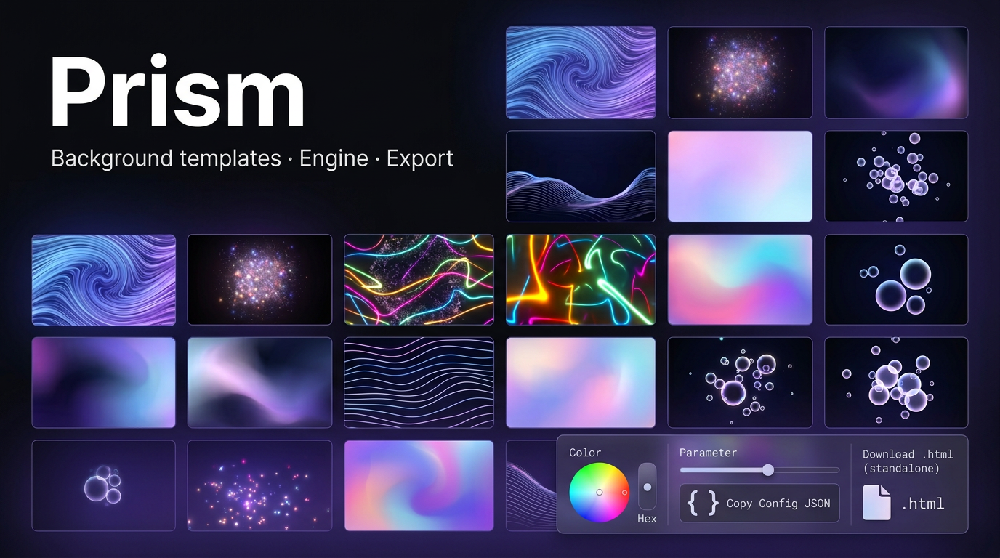

<div align="center">

# Prism

### Background templates · Engine · JSON



**Turn curated CodePen-grade scenes into *your* backgrounds** — preview full-screen, dial in colors and motion in the **Engine**, then **copy config** or **download a single `.html`** that runs anywhere. No backend. No account.

[](https://vitejs.dev/)
[](https://www.typescriptlang.org/)

**Live demo →** [prism-background-templates.vercel.app](https://prism-background-templates.vercel.app/)

<br />

</div>

---

## Why Prism?

Landing pages, portfolios, and product shells need atmosphere fast. Prism gives you **17 starting points** — WebGL, CSS, SVG, Three.js — in one place. You don’t ship a build pipeline for every pen: you **browse**, **tune**, and **export** (or paste JSON into your own pipeline).

- **Gallery** — One grid, every template with a live thumbnail preview.
- **Preview** — Open any template full-screen; see exactly what you’ll ship.
- **Engine** — Sliders and color controls wired to each scene’s API.
- **Copy JSON** — Serializable state for scripts, CMS, or your own tooling.
- **Download `.html` (standalone)** — One file with inlined assets + `window.__PRISM_BOOTSTRAP`. Open locally or drop on any static host.

---

## How to use it (60 seconds)

1. **Open the app** — You’ll land on the **gallery**: cards for templates `1`–`17`.
2. **Pick a template** — Click a card or use **`?id=5`** / **`#/preview/5`** in the URL.
3. **Preview** — The template runs in a full-page iframe (what you see is what you get).
4. **Open the Engine** — Use the side panel: colors, timing, density — whatever that template exposes.
5. **Ship your variant**
   - **Copy config JSON** — Paste into code, docs, or version control.
   - **Download .html (standalone)** — Self-contained file; no Prism server required to view it.
6. **Share a link** — Use **Copy preview link** so teammates open the same template + route.

That’s it. Iterate until it feels right, then export.

---

## Run locally

**Requirements:** [Node.js](https://nodejs.org/) **18+** (LTS recommended).

```bash
git clone https://github.com/WebRaizo30/prism-background-templates.git
cd prism-background-templates
npm install
npm run dev
```

Open the URL Vite prints (e.g. `http://localhost:5173`).

**Production build** (static output in `dist/`, including the full `templates/` tree):

```bash
npm run build
npm run preview
```

| Script | What it does |
| ------ | ------------ |
| `npm run dev` | Dev server + `/templates/` static serving |
| `npm run build` | Optimized build → `dist/` |
| `npm run preview` | Serve `dist/` locally before you deploy |

---

## Deploy (e.g. Vercel)

**Production:** [https://prism-background-templates.vercel.app/](https://prism-background-templates.vercel.app/)

Prism is a **static SPA** after `vite build`. Point your host at the **`dist`** folder (Vercel: **Output Directory** `dist`, **Build** `npm run build`, **Install** `npm install`).

If the site is **not** at the domain root, set Vite [`base`](https://vitejs.dev/config/shared-options.html#base) to your path prefix and rebuild.

---

## Repository map

| Path | Role |
| ---- | ---- |
| `src/main.ts` | Gallery, preview shell, engine mounting |
| `src/catalog.ts` | Titles, blurbs, preview URLs |
| `src/route.ts` | `?id` + `#/preview/:id` sharing |
| `src/prism/` | Per-template Engine UI + `exportTemplate*.ts` |
| `templates/<id>/` | Each scene (`dist/` for iframe, often `src/` for sources) |
| [`templates/ATTRIBUTION.md`](templates/ATTRIBUTION.md) | CodePen sources, authors, MIT |

Roadmap notes: [`docs/PLAN.md`](docs/PLAN.md).

---

## Attribution

Templates come from **CodePen** authors under **MIT**; see [`templates/ATTRIBUTION.md`](templates/ATTRIBUTION.md) and per-folder `LICENSE.txt` where present. Some pens still load **fonts or libraries from CDNs** — see ATTRIBUTION if you need to vendor assets for strict offline or compliance.

---

## Connect

**X (Twitter):** [@WebRaizo](https://x.com/WebRaizo) — updates, experiments, and what we ship next.

---

<div align="center">

**Prism** — *Backgrounds, engineered.*

</div>
